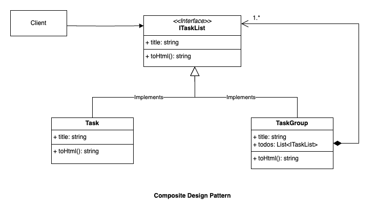

# Design Patterns in Go and Java

## Creational Design Pattern

1. [Factory Design Pattern](./factory_design_pattern)  
    Example UML for Factory Pattern:  
    

2. [Abstract Factory Design Pattern](./abstract_factory_design_pattern)  
    Example UML for Abstract Factory Pattern:  
    

3. [Singleton Design Pattern](./singleton_design_pattern)  
    - Use this pattern when there must be exactly one instance of a class, and 
    it must be accessible globally.
    - When the sole instance should be extensible by subclassing it.  
    Example UML for Singleton Design Pattern:  
    

4. [Builder Design Pattern](./builder_design_pattern)  

5. [Prototype Design Pattern](./prototype_design_pattern)  

6. [Object Pool Design Pattern](./object_pool_design_pattern)  
    - Use this pattern when the cost of object creation is high and the number of
    objects required at a time are low.
    - For example, the database connection object.  
   Example UML for Object Pool Design Pattern:  
   

## Structural Design Patterns

1. [Adapter Design Pattern](./adapter_design_pattern)  
    - Convert the interface of a class into another interface clients expect.
    - Adapter lets classes work together that couldn't otherwise because of 
    incompatible interfaces.  
    Example UML for Adapter Pattern:  
    

2. [Decorator Design Pattern](./decorator_design_pattern)
    - Use this pattern to attach additional responsibilities to an individual
    objects dynamically and transparently, that is, without affecting other
    objects.
    - Use for responsibilities that can be withdrawn.
    - Use when extension by subclassing is impossible.  
    Example UML for Decorator Pattern:  
    

3. [Bridge Design Pattern](./bridge_design_pattern)
    - Use this pattern when we want to avoid a permanent binding between an 
    abstraction, and it's implementation. This might be the case, for example,
    when the implementation must be selected or switched at run-time.
    - Both abstractions and their implementations should be extensible by
    subclassing them independently. We can combine abstractions and implementations
    and extend them independently.
    - Changes in the implementation of an abstraction should have no impact
    on client; that is, their code should not have to be recompiled.
    - We want to share an implementation among multiple objects (perhaps using 
    reference counting), and this fact should be hidden from the client.  
    Example UML for Bridge Pattern:  
    

4. [Composite Design Pattern](./composite_design_pattern)
    - Use this pattern when we want to represent part-whole hierarchies of objects.
    - We want clients to be able to ignore the difference between compositions of
    objects and individual objects. Clients will treat all objects in the
    composite structure uniformly.
    - This pattern is useful when we want to represent structures like hierarchy
    (user hierarchy, role hierarchy), file system/directory structure, etc.  
    Example UML for Composite Pattern:
    

## Behavioural Design Patterns

1. [Strategy Design Pattern](./strategy_design_pattern)  
    Example UML for Strategy Pattern:  
    

## Domain Driven Design Patterns

1. [Repository Design Pattern](./repository_design_pattern)  
    Repository design pattern is used for providing abstraction to the
    data access logic. Using Repository Design Pattern, the business logic
    layer of your application need not have any knowledge on how data 
    persistence happens beneath.  
    Example UML for Repository Pattern:  
    
