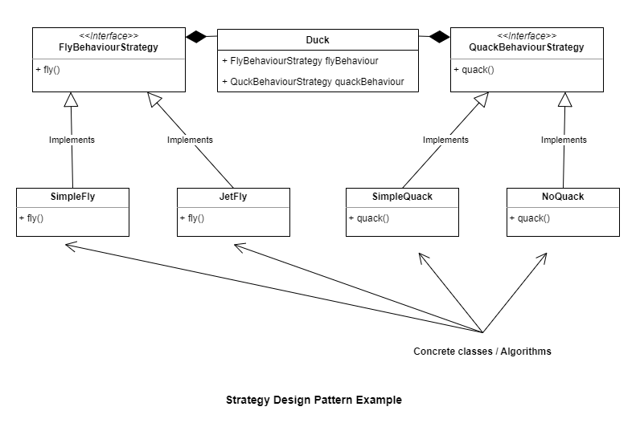

# Design Patterns in Go

## Creational Design Pattern

1. [Factory Design Pattern](./factory_design_pattern)  
    Example UML for Factory Pattern:
    

## Behavioural Design Patterns

1. [Strategy Design Pattern](./strategy_design_pattern)  
    Example UML for Strategy Pattern:  
    

## Domain Driven Design Patterns

1. [Repository Design Pattern](./repository_design_pattern)  
    Repository design pattern is used for providing abstraction to the
    data access logic. Using Repository Design Pattern, the business logic
    layer of your application need not have any knowledge on how data 
    persistence happens beneath.  
    Example UML for Repository Pattern:
    
