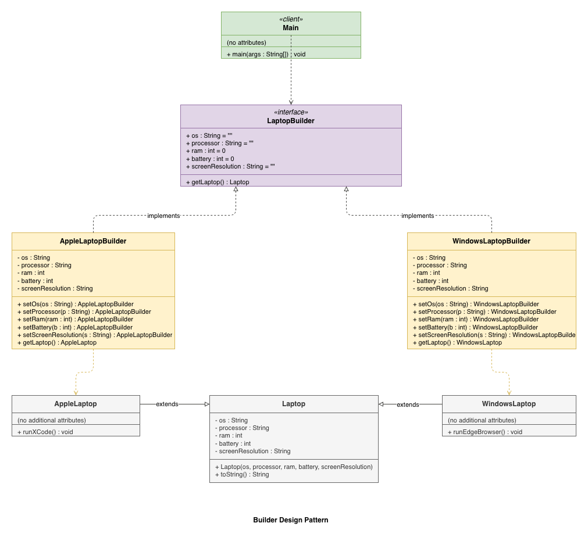

# Builder Design Pattern

## Intent
Separate the construction of a complex object from its representation so that the same
construction process can create different representations.

## When to use
- The algorithm for creating a complex object should be independent of the parts that
  make up the object.
- The construction process must allow different representations for the object that are
  constructed.

## Structure
Example UML for Builder Pattern:

