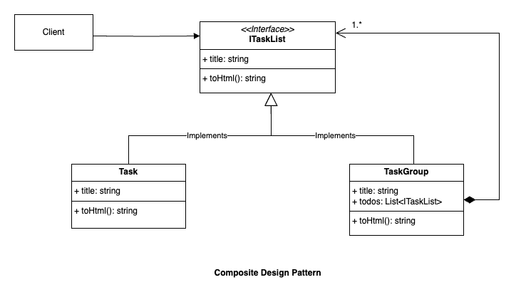

# Composite Design Pattern

## Intent
Compose objects into tree structures to represent part-whole hierarchies.
Composite lets clients treat individual objects and compositions of objects
uniformly.

## When to use
- Use this pattern when we want to represent part-whole hierarchies of objects.
- We want clients to be able to ignore the difference between compositions of
  objects and individual objects. Clients will treat all objects in the
  composite structure uniformly.
- This pattern is useful when we want to represent structures like hierarchy
  (user hierarchy, role hierarchy), file system/directory structure, etc.

## Structure
Example UML for Composite Pattern:

