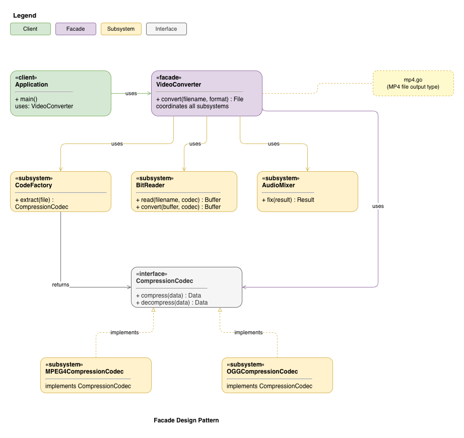

# Facade Design Pattern

## Intent
Provide a unified interface to a set of interfaces in a subsystem.
Facade defines a higher-level interface that makes the subsystem easier to use.

## When to use
- Use this pattern when we want to provide a simple interface to a complex
  subsystem.
- When there are many dependencies between the classes in the subsystem, and
  we want to restrict access to these dependencies.
- We want to define an entrypoint to the subsystem.

## Structure
Example UML for Facade Pattern:

